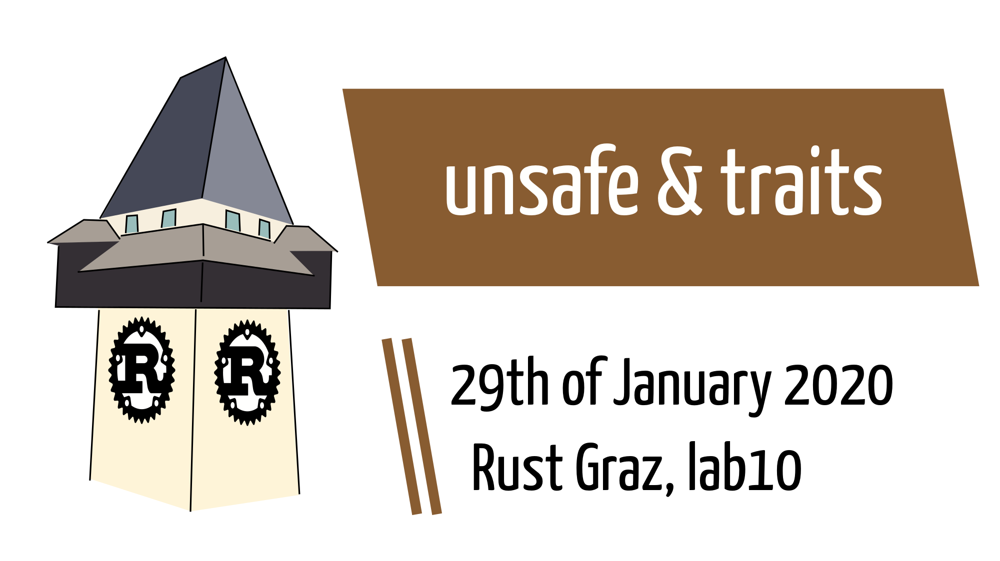

# Prologue

---

## Prologue: Is UTF-8 robust w.r.t. to bit flips?

Consider the following [contrived] notion of robustness.

> Let {X} be a valid UTF-8 string. Is [A, {X}, A] a valid UTF-8 string if one arbitrary bit flip occurs?

---

## Prologue: Is UTF-8 robust w.r.t. to bit flips?

```rust
// Consider a byte array like [0b1000001, 0b11110xxx,
// 0b10xxxxxx, 0b10xxxxxx, 0b10xxxxxx, 0b1000001]
// where x denote arbitrary bits.
// Continue only if the array is a valid UTF-8 string.
// Now introduce one arbitrary bit flip in any bit of
// the 4 mid bytes. Does it give a valid UTF-8 string?
// Returns the total number of tests and invalid strings.
```

---

## Prologue: Is UTF-8 robust w.r.t. to bit flips?

```rust
fn flips_in_4_bytes() -> (u64, u64) {
  let mut total = 0u64;
  let mut invalid = 0u64;

  let mut text = [
    'A' as u8,
    0b1111_0000u8, 0b10_000000,
    0b10_000000, 0b10_000000,
    'A' as u8,
  ];
  // TODO next slide

  (total, invalid)
}
```

---

## Prologue: Is UTF-8 robust w.r.t. to bit flips?

```rust
// base gives x-values in 11110xxx 10xxxxxx 10xxxxxx 10xxxxxx
for base in 0..=2097152u32 {
  // bit_flip defines the index of the bit to flip
  for bit_flip in 0..32 {
    text[1] = 0b1111_0000 | (base & 0b111) as u8;
    text[2] = 0b1000_0000 | ((base >> 3) & 0b0011_1111) as u8;
    text[3] = 0b1000_0000 | ((base >> 9) & 0b0011_1111) as u8;
    text[4] = 0b1000_0000 | ((base >> 15) & 0b0011_1111) as u8;
    if str::from_utf8(&text).is_err() {
      continue
    }
    // TODO next slide
    total += 1;
  }
}
```

---

## Prologue: Is UTF-8 robust w.r.t. to bit flips?

```rust
      // apply bit flip
      if bit_flip < 8 {
        text[1] = text[1] ^ (1 << bit_flip);
      } else if bit_flip < 16 {
        text[2] = text[2] ^ (1 << (bit_flip - 8));
      } else if bit_flip < 24 {
        text[3] = text[3] ^ (1 << (bit_flip - 16));
      } else {
        text[4] = text[4] ^ (1 << (bit_flip - 24));
      }
      match str::from_utf8(&text) {
        Ok(_) => {},
        Err(_) => invalid += 1,
      };
```

---

## Prologue: Is UTF-8 robust w.r.t. to bit flips?

<table>
<thead><tr><td>bytes</td><td>strings</td><td>turned invalid</td><td>%</td></tr></thead>
<tbody>
<tr><td>1</td><td>1024</td><td>128</td><td>12.5 %</td></tr>
<tr><td>2</td><td>30,720</td><td>10,112</td><td>33.0 %</td></tr>
<tr><td>3</td><td>1,474,560</td><td>512,000</td><td>34.7 %</td></tr>
<tr><td>4</td><td>33,554,432</td><td>13,107,200</td><td>39.1 %</td></tr>
<tr><td></td><td>35,060,736</td><td>13,629,440</td><td>38.9 %</td></tr>
</tbody>
</table>

---

## Prologue: Is UTF-8 robust w.r.t. to bit flips?

Is `[A, {X}, A]` a valid UTF-8 string if one arbitrary bit flip occurs? Yes, with 61.6 % chance.


# Dialogue: `actix`

---

## actix

[https://actix.rs/](https://actix.rs/)

* “rust's powerful actor system and most fun web framework”
* Uses [tokio](https://crates.io/crates/tokio) (“asynchronous run-time for Rust”)
* Uses [futures](https://crates.io/crates/futures) (“zero-cost asynchronous programming in Rust”)
* `async`/`sync` actors
* Actor supervision
* Typed messages
* HTTP 1 / HTTP 2 support ⇒ `actix_web`

---

## actix_web

“[Actix web](https://github.com/actix/actix-web ) is a small, pragmatic, and extremely fast rust web framework.”

* routing
* GET/POST parameters
* form handling
* `serde` for serialization
* many dependencies, but [fastest web framework](https://www.techempower.com/benchmarks/#section=data-r18)

---

## actix_web

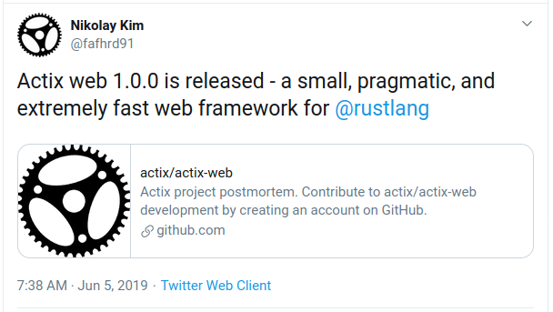

---

## actix_web example

```rust
use actix_web::{web, App, Responder, HttpServer};

async fn index(info: web::Path<String>) -> impl Responder {
    format!("Hello {}!", info)
}

#[actix_rt::main]
async fn main() -> std::io::Result<()> {
    HttpServer::new(|| App::new().service(
        web::resource("/{name}").to(index))
    ).bind("localhost:8080")?.run().await
}
```

---

## actix_web example

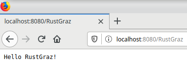


# Dialogue: The `actix-web` incident

---

## github page (2019-12-17)

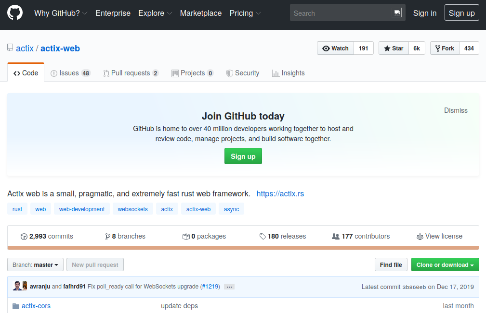

---

## github page (2019-12-17)

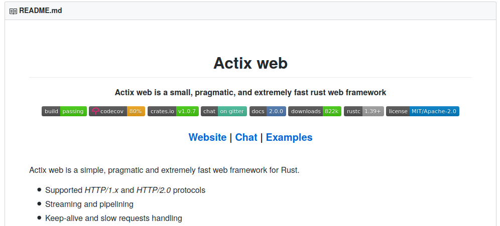

---

## github page (2020-01-17)

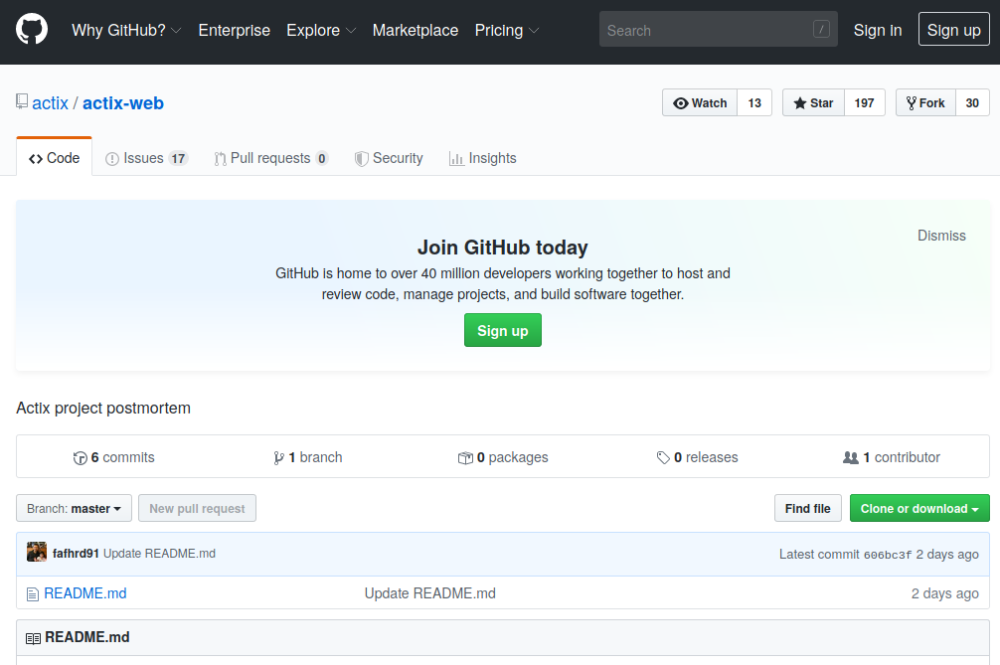

---

## github page (2020-01-17)

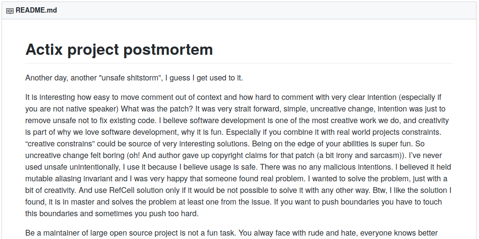

---

## Tweet by @fafhrd91

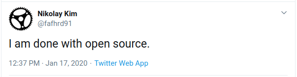

---

## README text excerpts

> Another day, another "unsafe shitstorm”, I guess I get used to it.

---

## README text excerpts

> I’ve never used unsafe unintentionally, I use it because I believe usage is safe. There was no any malicious intentions. I believed it held mutable aliasing invariant and I was very happy that someone found real problem.

---

## README text excerpts

> Be a maintainer of large open source project is not a fun task. You alway face with rude and hate, everyone knows better how to build software, nobody wants to do home work and read docs and think a bit and very few provide any help.

---

## README text excerpts

> For example, async/await took three weeks 12 hours/day work stint, quite exhausting, and what happened after release, I started to receive complaints that docs are not updated and i have to go fix my shit.

---

## README text excerpts

> […] But damage to the project's reputation is done and I don’t think it is possible to recover. Actix always will be “shit full of UB” and “benchmark cheater”.

---

## README text excerpts

> (Btw, with tfb benchmark I just wanted to push rust to the limits, I wanted it to be on the top, I didn’t want to push other rust frameworks down.)

---

## README text excerpts

> Everything started with actix, then actix-web and then actix-net. It took a lot of time to design api and architecture. Each of this projects was rewritten from scratch at least 4-5 time

---

## README text excerpts

> Nowadays supporting actix project is not fun, and be part of rust community is not fun as well.
>
> I am done with open source.
> […]
> Everything has to come to the end. It was fun trip but now is time to move on. Life should be fun.

---

## Summary

* Somehow related to some shitstorm
* Shitstorm was somehow related to some `unsafe` feature of rust
* github repo was wiped (incl. issues) and README with post mortem text appeared
* @fafhrd91 used to be incredibly active and supportive towards users

→ An attempt of a reconstruction

---

## 2018/06/08 

* [github issue #289](https://github.com/actix/actix-web/issues/332)
* title “Unsound uses of Unsafe in API”
* “Right now the actix-web code contains 100+ uses of unsafe. Presumably this is in order to achieve the best possible performance in hot parts of the code.” …

---

## 2018/06/12

* [github issue #301](https://github.com/actix/actix-web/issues/301)
* issue is related to a memory-safety bug. Technical discussion is started.
* [comment](https://github.com/actix/actix-web/issues/301#issuecomment-396426085) by @fafhrd91 “@seanmonstar do you think I don’t understand impl Send? :)”  11× 👎

---

## 2018/07/06

* reddit thread references issue #289
* title [“actix-web has removed all unsound use of unsafe in its codebase. It's down to less than 15 occurences of unsafe from 100+”](https://www.reddit.com/r/rust/comments/8wlkbe/actixweb_has_removed_all_unsound_use_of_unsafe_in/)

---

## 2020/01/17

* reddit thread “Actix-net unsoundness patch "is boring"”
* by user Code-Sandwich

  * brings github issue #83 to reddit user's attention (is deleted these days)
  * Summarizes issue #83
  * Asks “I hope it's an objective summary. Any thoughts?”

---

## Issue #83 2020-01-08 and later

[@Shnatsel opens the issue](http://archive.is/TokNs#selection-1603.1-1609.0):

> The following code is unsound:
> [actix-net/actix-service/src/cell.rs Lines 34 to 36 in 7c5fa25]
> This uses Rc::as_ref() to obtain a reference to the underlying data, which does not guarantee uniqueness. It is possible to obtain several mutable references to the same memory location by calling this function repeatedly: […]

---

## Issue #83 excerpts

@fafhrd91

> This is internal code. There is no repeated call to get_mut() anywhere in code

Closes issue.

@fafhrd91

> Please, don’t start

---

## Issue #83 excerpts

@Shnatsel

> These two references *do not need to exist in the same function* to trigger undefined behavior, they only need to exist at the same point in time.
An easy way to see if this is a problem in practice is replace .as_ref() with .get_mut().unwrap() and see if anything panics.

---

## Issue #83 excerpts

@cdbattags

> I don't think "unsound" was meant to be personal or offensive. Why close this so quickly?

@fafhrd91

> I need unit test that shows UB. Unit test must use public api.

---

## Issue #83 excerpts

@Nemo157

[provides such a unit test]

@JohnTitor

> I think it's worth to fix, re-opening.


---

## Issue #83 excerpts

@fafhrd91

> @Nemo157 @repnop nice! finally some real code!
>
> [provides patch]
>
> should be fixed in master

---

## Issue #83 excerpts

Discussion about incompleteness of patch.
Nemo157 provides patch using `Rc<RefCell<A>>`, not `Cell<A>` to ensure borrow safety at runtime.

@fafhrd91

> this patch is boring

---

## Issue #83 excerpts

@CJKay

> quote[this patch is boring]
> So is resolving silent data corruption.

---

## Issue #83 excerpts

@bbqsrc

> @fafhrd91 seriously? Please just stop writing Rust. You do not respect semver, you do not respect soundness, so why are you using a language predominantly based around doing these things right?

---

## Community responses

---

<a href="https://www.reddit.com/r/rust/comments/eprfmi/actix_dev_once_again_demonstrates_no_care_for/" />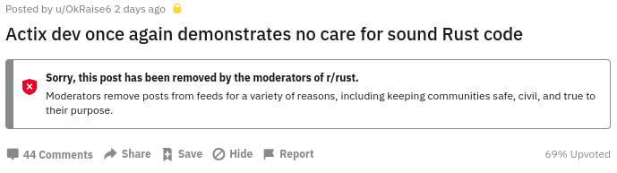</a>

---

<a href="https://www.reddit.com/r/rust/comments/epoloy/ive_smoketested_rust_http_clients_heres_what_i/feksq2i/">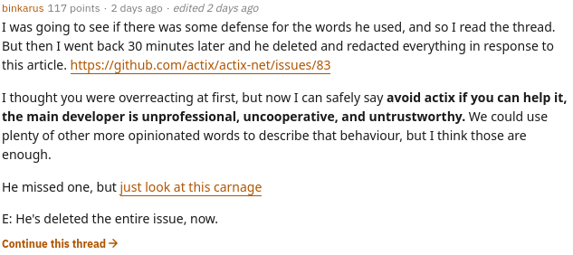</a>

---

<a href="https://twitter.com/mgattozzi/status/1217953913581776897">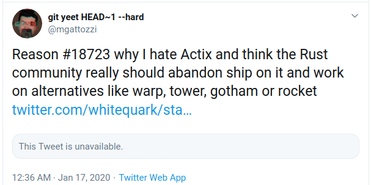</a>

---

<a href="https://twitter.com/tomaka17">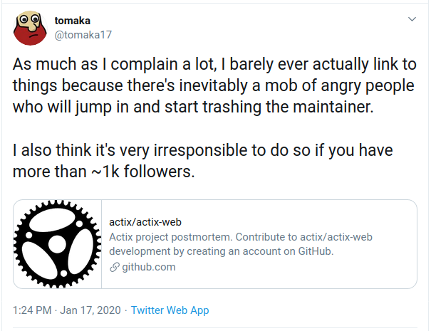</a>

---

<a href="https://twitter.com/thestusmall/status/1218173715671855107">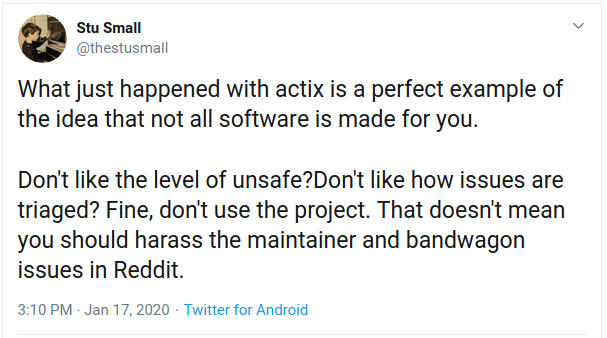</a>

---

<a href="https://gitter.im/actix/actix?at=5e2160575cd796466064c42b">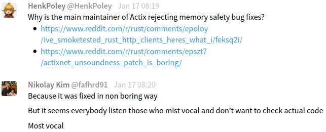</a>

---

<a href="https://twitter.com/pauldix/status/1218176077396357122">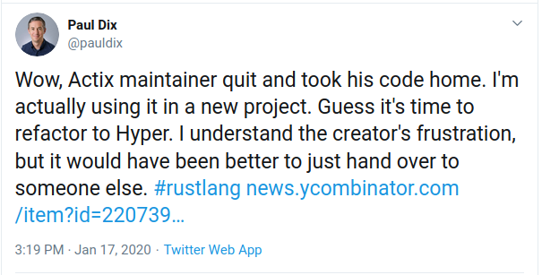</a>

---

<a href="https://gitter.im/actix/actix">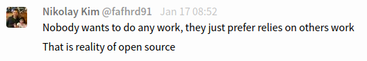</a>

---

<a href="https://twitter.com/jedisct1/status/1218177431221174273">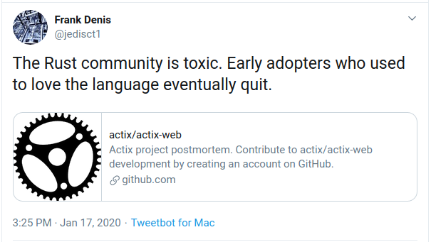</a>

---

<a href="https://gitter.im/actix/actix">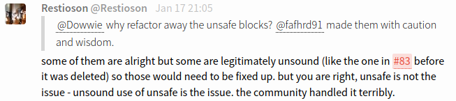</a>

---

<a href="https://twitter.com/steveklabnik/status/1218177905433464839">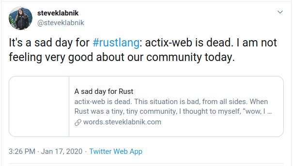</a>

---

<a href="https://gitter.im/actix/actix">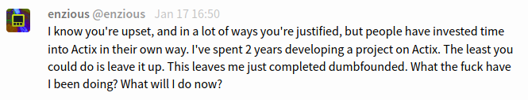</a>

---

<a href="https://twitter.com/vladikoff/status/1218192131346571264">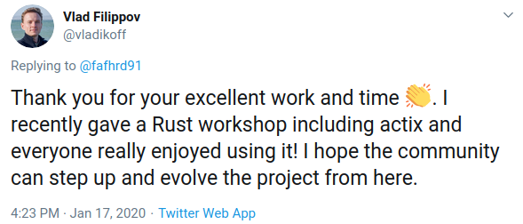</a>

---

<a href="https://gitter.im/actix/actix-web?at=5e21d2d78e073f465f09fd5e"></a>

---

<a href="https://twitter.com/mitsuhiko/status/1218201419028799490">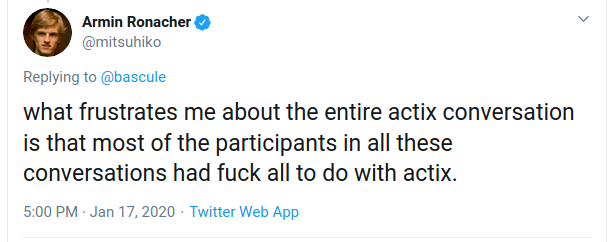</a>

---

<a href="https://twitter.com/jsbarretto/status/1218217844384706562">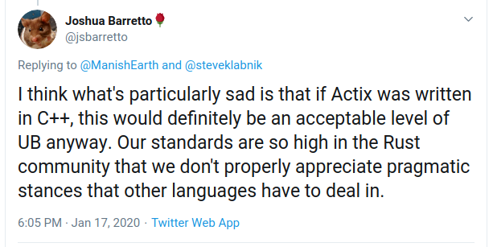</a>

---

<a href="https://twitter.com/sgrif/status/1218229956410372098">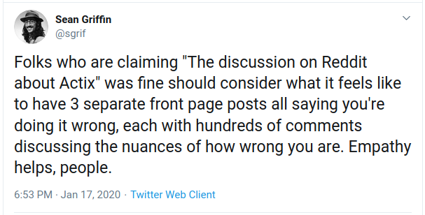</a>

---

<a href="https://github.com/actix-support/letter">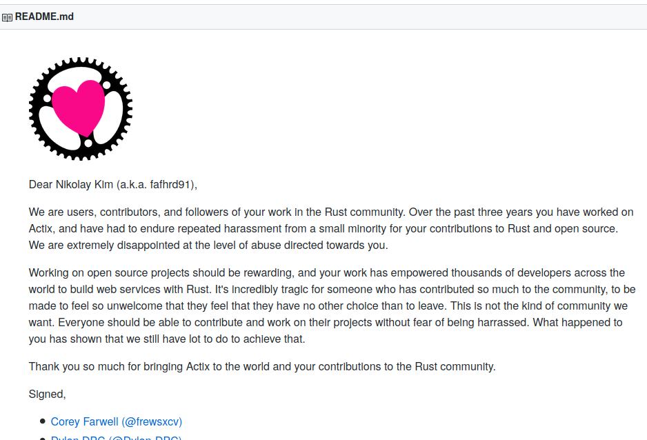</a>

---

<a href="https://twitter.com/JTremback/status/1218277110235557889">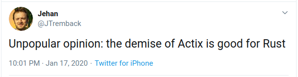</a>

---

<a href="https://twitter.com/MingshenSun/status/1218389035137163269">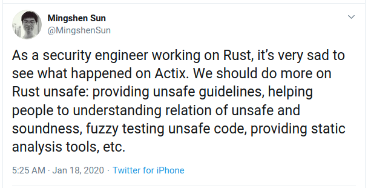</a>

---

<a href="https://twitter.com/withoutboats/status/1218497736523296770">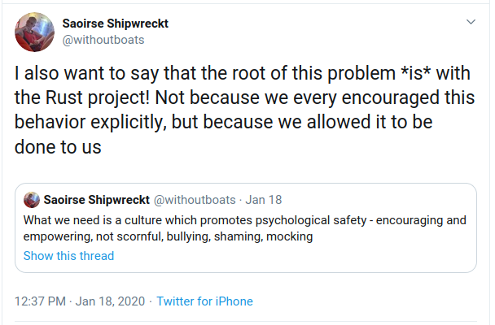</a>

---

<a href="https://twitter.com/ashton/status/1218694130512957440">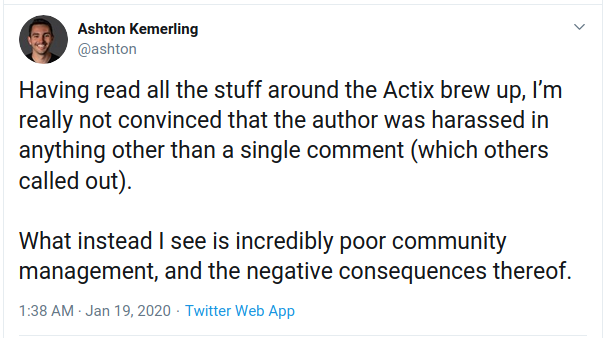</a>

---

<a href="https://twitter.com/raphlinus/status/1218404387023777792">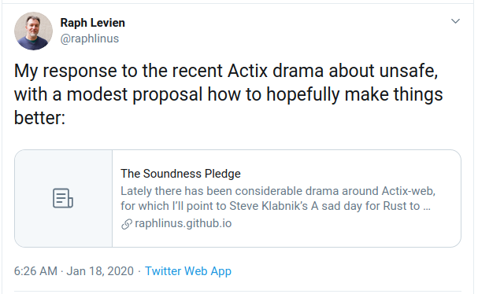</a>

→ [“The Soundness Pledge”](https://raphlinus.github.io/rust/2020/01/18/soundness-pledge.html)

---

## The Soundness Pledge

> “The intent of this crate is to be free of soundness bugs. The developers will do their best to avoid them, and welcome help in analyzing and fixing them.”

---

<a href="https://www.reddit.com/r/programming/comments/epzmx6/rust_actix_project_postmortem/feunaae/">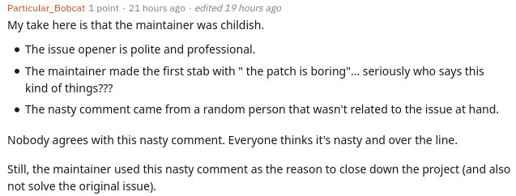</a>

---

## Github issues on 2020-01-20

* lmao
* a sad day for rust ... and me
* actix-web is great
* jealous assholes
* Cheer up
* Please continue....
* Proud of your Awesome work!
* Don't take shit from anyone
* Condorcet

---

## Github issues on 2020-01-20

* It's fair
* fork?
* We love actix, thank you for creating it!
* Don't care about the prejudices of those few people, support you！
* Actix is still awesome
* Consider applying for GitHub sponsorship?
* Please archive the project instead of deleting it.
* Thank you for your service

---

<a href="https://github.com/actix/actix-web/issues/1289">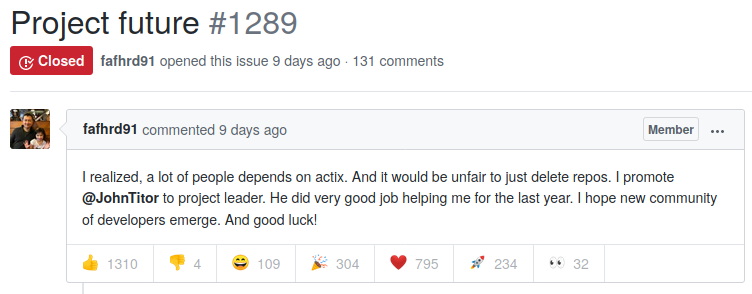</a>

… with purely positive replies.

---

## Resources

* [Wiped repo](https://github.com/actix/actix-web)
* [HackerNews thread](https://news.ycombinator.com/item?id=22073908)
* [Support letter repo for Nikolay](https://github.com/actix-support/letter)
* [Steve Klabnik's blog post](https://words.steveklabnik.com/a-sad-day-for-rust)
* [“The Soundness pledge”](https://raphlinus.github.io/rust/2020/01/18/soundness-pledge.html)
* [reddit discussion](https://www.reddit.com/r/rust/comments/epzukc/actix_web_repository_cleared_by_author_who_says/)

---

## Questions to contemplate

* What are the expectations/responsibilities of a community/maintainer?
* Is there a difference between a commercial and a hobby project?
* When shall I contribute or fork a project?
* How many maintainers/contributors does a project need?
* How much shall we consider differences in cultural norms?
* What non-technical aspects do we need to discuss/ensure in a project?

---

## Unquestionably good advices

* Be lenient in what you accept. Be strict in what you send out.
* Try to understand each other. Expect the other has good intentions. In short: be respectful.
* Ask for help if you need advice.
* “Code of Conducts” make is explicit that “do whatever is legally allowed” sets the bar too low


# Dialogue: unsafe rust

---

## `unsafe`

See [Unsafe Rust](https://doc.rust-lang.org/book/ch19-01-unsafe-rust.html) section in the Rust book and [nomicon](https://doc.rust-lang.org/nomicon/meet-safe-and-unsafe.html).

1. Is a keyword in rust: `unsafe { let a = 42; }`
2. Applies to blocks of code, incl. functions, traits.
3. Does not turn off borrow checker or alike
4. Semantics are basic: Some responsibilities move from rust to the programmer!

---

## `unsafe` rationale

1. *Static analysis is conservative*. When the compiler tries to determine whether or not code upholds the guarantees, it’s better for it to reject some valid programs rather than accept some invalid programs.
2. *The underlying computer hardware is inherently unsafe*. Optimizations sometimes requires breaking strong guarantees.

---

## `unsafe` superpowers

1. Dereference a raw pointer
2. Call an unsafe function or method
3. Access or modify a mutable static variable
4. Implement an unsafe trait
5. Access fields of unions

---

## Raw pointers

→ does not require unsafe rust. But we can’t dereference raw pointers outside an unsafe block.

1. Are allowed to ignore the borrowing rules by having both immutable and mutable pointers or multiple mutable pointers to the same location
2. Aren’t guaranteed to point to valid memory
3. Are allowed to be null
4. Don’t implement any automatic cleanup

---

## In practice: raw pointers

```rust
fn main() {
    let addr = 0x00;
    let ptr = addr as *const i32;
    println!("{}", *ptr);
}
```

`ptr` is a raw pointer. Does it compile?

---

```
error[E0133]: dereference of raw pointer is unsafe and
              requires unsafe function or block
 --> unsafe_tests.rs:4:20
  |
4 |     println!("{}", *ptr);
  |                    ^^^^ dereference of raw pointer
  |
  = note: raw pointers may be NULL, dangling or unaligned;
    they can violate aliasing rules and cause data races:
    all of these are undefined behavior

error: aborting due to previous error
```

---

## In practice

```rust
fn main() {
    let addr = 0x00;
    let ptr = addr as *const i32;
    unsafe {
        println!("{}", *ptr);
    }
}
```

---

## In practice

```
meisterluk@gardner ~ % ./unsafe_block
[1]    29915 segmentation fault  ./unsafe_block
```

---

## In practice

```rust
unsafe fn deref() {
    let addr = 0x00;
    let ptr = addr as *const i32;
    println!("{}", *ptr);
}

fn main() {
    unsafe {
        deref();
    }
}
```

If `unsafe` block is omitted, “call to unsafe function is unsafe and requires unsafe function or block”

---

## In practice: `mut` static variable

```rust
static MY_INT: u64 = 42;
  
fn main() {
    println!("{}", MY_INT);
}
```

→ type specifier is required

---

## In practice

```rust
static MY_INT: u64 = 42;

fn main() {
    MY_INT += 1;
    println!("{}", MY_INT);
}
```

---

## In practice

```rust
static MY_INT: u64 = 42;

fn main() {
    MY_INT += 1;
    println!("{}", MY_INT);
}
```

Does it compile?

---

## In practice

```
error[E0594]: cannot assign to immutable static item `MY_INT`
 --> mut_static_var.rs:4:5
  |
4 |     MY_INT += 1;
  |     ^^^^^^^^^^^ cannot assign

error: aborting due to previous error
```

---

## In practice

```rust
static mut MY_INT: u64 = 42;
  
fn main() {
    MY_INT += 1;
    println!("{}", MY_INT);
}
```

Does it compile?

---

## In practice

```
error[E0133]: use of mutable static is unsafe
              and requires unsafe function or block
 --> mut_static_var.rs:4:5
  |
4 |     MY_INT += 1;
  |     ^^^^^^^^^^^ use of mutable static
  |
  = note: mutable statics can be mutated by multiple
    threads: aliasing violations or data races will
    cause undefined behavior

error[E0133]: use of mutable static is unsafe and
              requires unsafe function or block
 --> mut_static_var.rs:5:20
  |
5 |     println!("{}", MY_INT);
  |                    ^^^^^^ use of mutable static
  |
  = note: mutable statics can be mutated by multiple
    threads: aliasing violations or data races will
    cause undefined behavior
```

---

## In practice

```rust
static mut MY_INT: u64 = 42;
  
fn main() {
    unsafe {
        MY_INT += 1;
    }
    println!("{}", MY_INT);
}
```

Does it compile?

---

## In practice

```
error[E0133]: use of mutable static is unsafe and
              requires unsafe function or block
 --> mut_static_var.rs:7:20
  |
7 |     println!("{}", MY_INT);
  |                    ^^^^^^ use of mutable static
  |
  = note: mutable statics can be mutated by multiple
    threads: aliasing violations or data races will
    cause undefined behavior
```

---

## In practice

```rust
static mut MY_INT: u64 = 42;
  
fn main() {
    unsafe {
        MY_INT += 1;
        println!("{}", MY_INT);
    }
}
```

---

## In practice: `union`

```rust
#[repr(C)]
union Ambiguous {
    my_int: u32,
    addr: *const u32,
}

fn main() {
    let a = Ambiguous { my_int: 0x00 };
    println!("{}", *a.addr);
}
```

---

## In practice

```
error[E0133]: access to union field is unsafe and
              requires unsafe function or block
 --> enum.rs:9:20
  |
9 |     println!("{}", *a.addr);
  |                    ^^^^^^^ access to union field
  |
  = note: the field may not be properly initialized: using uninitialized data will cause undefined behavior

error[E0133]: dereference of raw pointer is unsafe
              and requires unsafe function or block
 --> enum.rs:9:20
  |
9 |     println!("{}", *a.addr);
  |                    ^^^^^^^ dereference of raw pointer
  |
  = note: raw pointers may be NULL, dangling or unaligned;
    they can violate aliasing rules and cause data races:
    all of these are undefined behavior
```

---

## Do I see unsafe rust in the documentation?

Yes, because you need to call it unsafely.

Example: [Rc::assume_init](https://doc.rust-lang.org/std/rc/struct.Rc.html#method.assume_init)

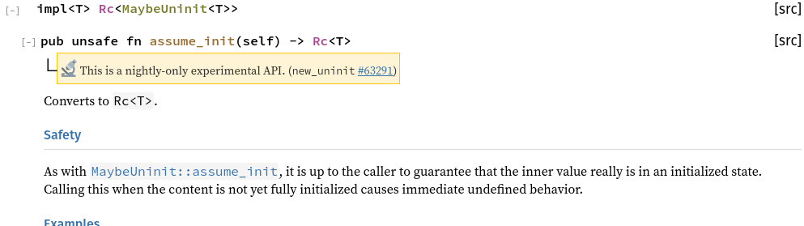

---

## So, how to consider unsafe rust?

---

## Compiler guarantees

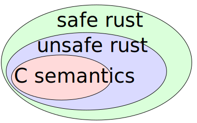

C ⊂ unsafe rust ⊂ safe rust

---

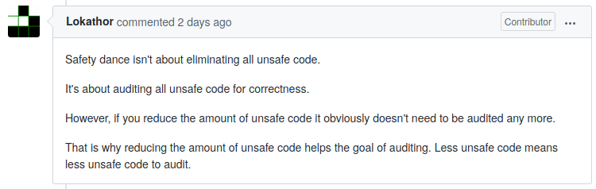

via [github: safety dance](https://github.com/rust-secure-code/safety-dance/pull/61)

---

[RustBelt: Logical Foundations for the Future of Safe Systems Programming](https://www.youtube.com/watch?v=1GjSfyijaxo&t=26m43s) by Derek Dreyer

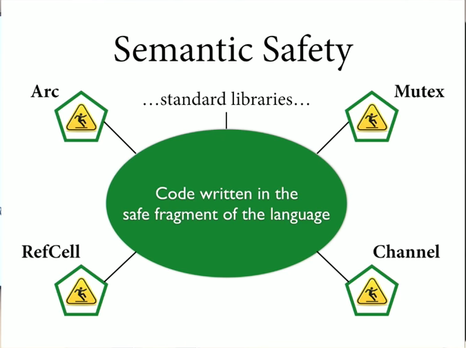

---

[RustBelt: Logical Foundations for the Future of Safe Systems Programming](https://www.youtube.com/watch?v=1GjSfyijaxo&t=26m43s) by Derek Dreyer

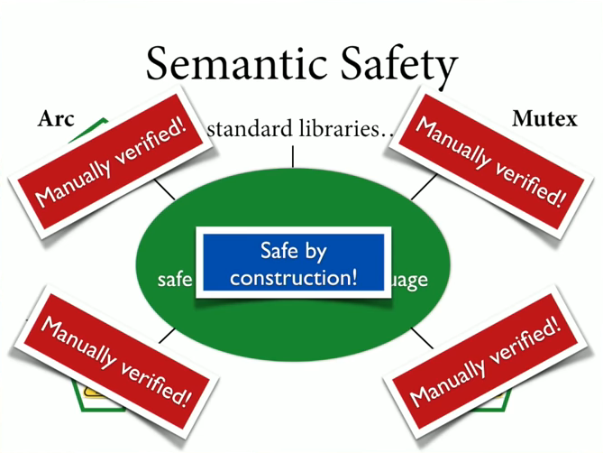


# Quiz

---

<dl>
<dt>A bit flip occurs in a valid UTF-8 string. How “likely” is it still valid?</dt>
<dd class="fragment">61.6 %</dd>
<dt>What is actix / actix-web?</dt>
<dd class="fragment">Actor system in rust / web framework</dd>
<dt>Lexically, <code>unsafe</code> is …</dt>
<dd class="fragment">a keyword</dd>
<dt>What are the differences of (un)safe rust?</dt>
<dd class="fragment">superpowers = {deref raw pointer, call unsafe fn, read/write mut static var, impl unsafe trait, read union fields}</dd>
</dl>

---

# Thanks!